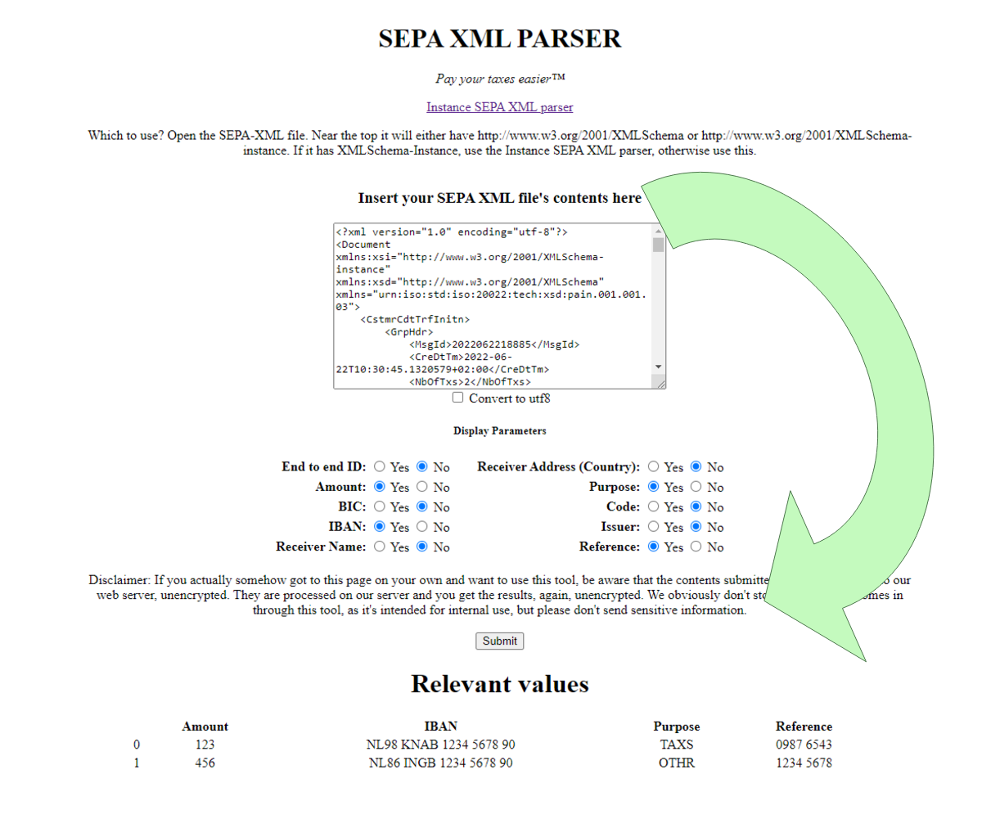

# SEPA-XML-Parser
A very simple web tool which takes a SEPA XML and prints out the relevant values (amount, IBAN, purpose and reference)

# SEPA XML
SEPA XML is a file type which contains one or more invoices. SEPA is not a world wide standard though. SEPA XML files are usually issued by businesses and governments to businesses, and are generally paid by uploading the file to your online bank. Some banks however lock away this feature under a more expensive pro or business plan. If you still want to pay your SEPA XML files, you can use this tool to extract the relevant information for the invoices contained in them. More information about SEPA XML: http://www.sepaforcorporates.com/sepa-implementation/sepa-xml-in-a-nutshell/

# Installation
You will need a web server. On windows, simply use XAMPP. For other platforms install Apache for your platform.

## First time setup
- Download and install XAMPP (https://www.apachefriends.org/)
- Download (zip) or clone (git) this repository (https://github.com/liambaloh/SEPA-XML-Parser)
- Open the folder: C:/xampp/htdocs
- Create a new folder called "sepa"
- Copy the file index.php from the downloaded repository into the folder "sepa".

## Use every time
- Open XAMPP Control panel
- Start Apache
- Open your web browser and navigate to http://localhost/sepa
- For every SEPA XML file:
  - Paste your SEPA XML file's contents into the big textbox at the top
  - Click submit
  - The relevant content of the file will appear below the textbox.
- Open XAMPP Control panel
- Stop Apache

## Problems?
If you encounter a bug or have a feature request, please open an issue here: https://github.com/liambaloh/SEPA-XML-Parser/issues. Thanks!
